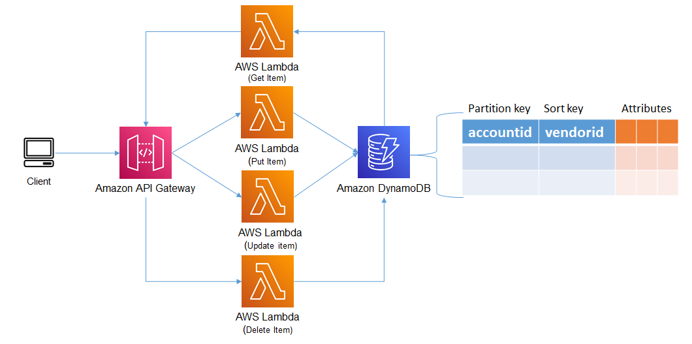

## Example
This example deploys an Amazon API Gateway, AWS Lambda functions and an Amazon DynamoDB table using the AWS CDK and TypeScript. The AWS Lambda functions are deployed behind an Amazon API Gateway and execute for CRUD (create, read, update, delete) operations against Amazon DynamoDB. The Amazon DynamoDB table is partitioned on an accountid attribute and also includes a sort key on the vendorid attribute, together they form the primary key. The example also demonstrates using Python to put, update, get and delete items in Amazon DynamoDB.




## Setup

[Getting started with AWS CDK](https://docs.aws.amazon.com/cdk/latest/guide/getting_started.html)

1. The following prerequisities are required for this example
  
```bash
npm install -g typescript
npm install -g aws-cdk
```

Install Jupyter Notebook following instructions on this ['site'](https://jupyter.org/install).

2. Since this CDK project uses ['Assests'](https://docs.aws.amazon.com/cdk/latest/guide/assets.html), you might need to run the following command to provision resources the AWS CDK will need to perform the deployment.

```bash 
cdk bootstrap
```

2. Install the dependencies

```bash
npm install
```

3. Execute **cdk synth** to synthesize as AWS CloudFormation template

```bash
cdk synth
```

4. Execute **cdk deploy** to deploy the template and build the stack

```bash
cdk deploy
```
5. Open the Jupyter Notebook in the **jupyter_notebook directory** follow the instructions.


## Cleanup Commands
1. Execute command: **cdk destroy**